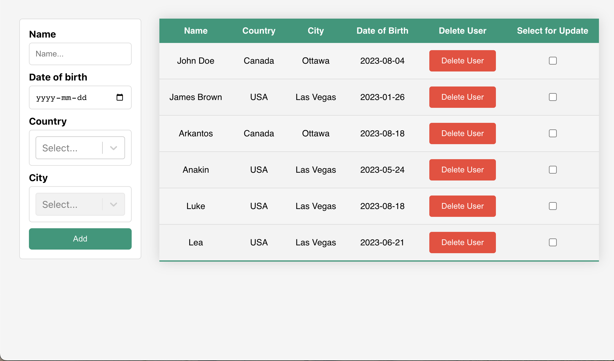

# User Management App

This is a simple user management application built with React and Firebase. The application allows you to add, update, and delete users, and displays a list of all users.

Which you can reach out from: https://user-management-app-ace80.web.app/

## Features

- Add new users with fields for name, date of birth, country, and city
- Update existing users
- Delete users
- View a list of all users
- Data is stored in Firebase Firestore, and updates in real time
- Uses Firebase Authentication for user sign-in

## Technologies Used

- React
- Firebase Firestore for the backend
- Firebase Authentication
- CoreUI for the frontend UI components
- React Hook Form for form handling
- TypeScript

## How to Run Locally

1. Clone the repository to your local machine.
2. Install the dependencies with `npm install`.
3. Create a `.env` file in the root directory of the project, and add your Firebase configuration variables:

        REACT_APP_FIREBASE_API_KEY=your-api-key
        REACT_APP_FIREBASE_AUTH_DOMAIN=your-auth-domain
        REACT_APP_FIREBASE_PROJECT_ID=your-project-id
        REACT_APP_FIRESTORE_STORAGE_BUDGET=your-storage-bucket
        REACT_APP_FIREBASE_MESSAGING_SENDER_ID=your-messaging-sender-id
        REACT_APP_FIREBASE_APP_ID=your-app-id
        REACT_APP_FIREBASE_MEASUREMENT_ID=your-measurement-id

4. Run the app with `npm start`. The app will be available at `localhost:3000`.

Please note that you need to have `node` and `npm` installed on your local machine.

## Project Structure

The main components of the project are:

- `NewUserForm`: This component is responsible for both adding new users and updating existing users.
- `UserList`: This component fetches the user data from Firestore and displays it in a table.
- `firebase.tsx`: This file contains the configuration and initialization of Firebase.

## Contributing

Pull requests are welcome. For major changes, please open an issue first to discuss what you would like to change.
